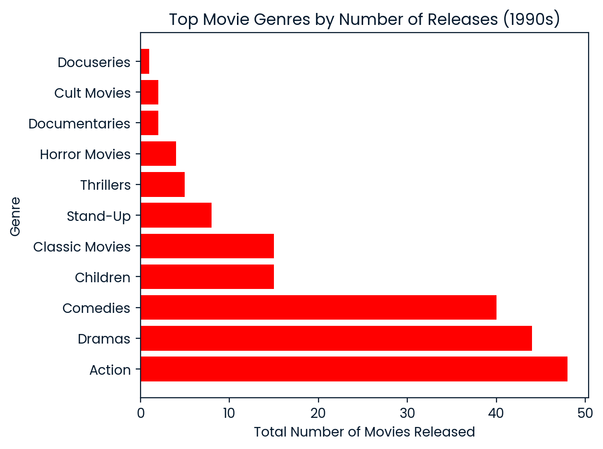
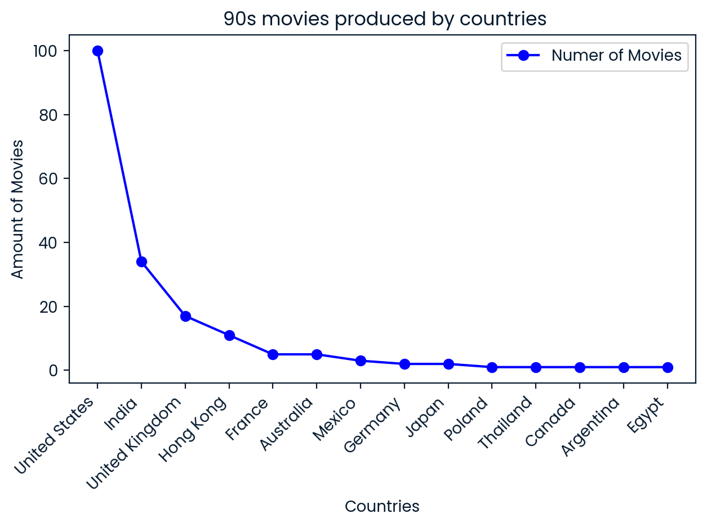

# netflix_90s_movie_analysis.py

🎬 **Netflix 90s Movie Analysis**  
A data-driven exploration of movie trends on Netflix, focusing on 1990s releases.  
This project analyzes patterns in movies of the nineties using Python, Pandas, and Matplotlib for data visualization.

---

**Netflix**, founded in 1997 as a DVD rental service, has grown into one of the world's largest entertainment platforms.

With its extensive library of movies and series, Netflix provides a great opportunity to apply data science techniques and uncover meaningful insights from its content catalog.

## The data
### **netflix_data.csv**
| Column | Description |
|--------|-------------|
| `show_id` | The ID of the show |
| `type` | Type of show |
| `title` | Title of the show |
| `director` | Director of the show |
| `cast` | Cast of the show |
| `country` | Country of origin |
| `date_added` | Date added to Netflix |
| `release_year` | Year of Netflix release |
| `duration` | Duration of the show in minutes |
| `description` | Description of the show |
| `genre` | Show genre |

---

## 🔍 Key Discoveries

### ❓ What was the most common movie duration in the 1990s?
The most ***frequent movie duration for 1990s*** titles in the Netflix dataset is **94 minutes**.  
This slightly surpasses the industry’s typical average of 90 minutes, suggesting that Netflix’s 90s catalog may lean toward slightly longer films.

### 🎬 How many short movies were released in the 1990s? (Less than 90 mins)
A total of **184 short action movies** from the 1990s are present in the dataset.

### 🎭 Which movie genre was most popular in the 1990s?
With the highest number of releases in the 1990s, the **Action genre** clearly dominated the decade, reflecting both industry investment and global audience preferences for dynamic, adrenaline-filled narratives.

**The chart below shows the number of movies per genre released between 1990 and 1999:**

### 🌎 Which countries produced the most 90s movies on Netflix?
With the highest number of movie releases in the 1990s, the United States clearly dominated film production during the decade, followed closely by India and the United Kingdom. This pattern reflects the strength of these countries’ film industries and the global demand for diverse cinematic content throughout that period.

**The chart below shows the number of movies produced by country between 1990 and 1999, highlighting the broad international representation in Netflix's catalog from that era:**

 
